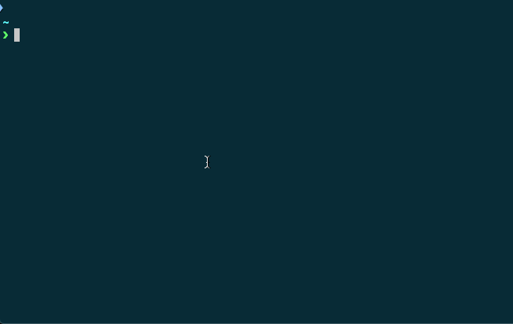

# XRP-CLI

A Node-based CLI for the XRP Ledger.

Note: At the moment the CLI only supports Testnet accounts.

## Installation

To install the XRP CLI, just run `npm install -g xrp-cli`. This will put the `xrp` command on your PATH.

Alternatively, you can clone this repo, and run `npm install -g` from inside this repository.

If you don't wish to install the XRP CLI globally, you can run locally from inside this repository using `yarn start` instead of `xrp`.

## API Methods

To invoke the CLI, type `xrp` into your terminal. You can always type `help` after a command to get a detailed list of subcommands or explanations of a command.

### `xrp address`

- `xrp address list`: List all of the addresses managed by the CLI, and their respective balances.

#### Adding Addresses

- `xrp address generate`: Generate a new XRP address, following step by step instructions.
- `xrp address add`: Add an externally generated address. You will need both the address and the secret used to generate the address. This is useful for letting the CLI control an already funded address generated by the Testnet Faucet: https://xrpl.org/xrp-testnet-faucet.html

#### Removing Addresses

- `xrp address remove <alias>`: Remove an address managed by the CLI.

### `xrp use`

- `xrp use <address_alias>`: Takes an address alias and makes this address your primary/default address. When you generate transactions using the CLI, this will be the "source" or sending account.

### `xrp send`

- `xrp send direct`: A way to send XRP directly to another account on the Testnet. Will open a prompt for more detailed transaction information.
